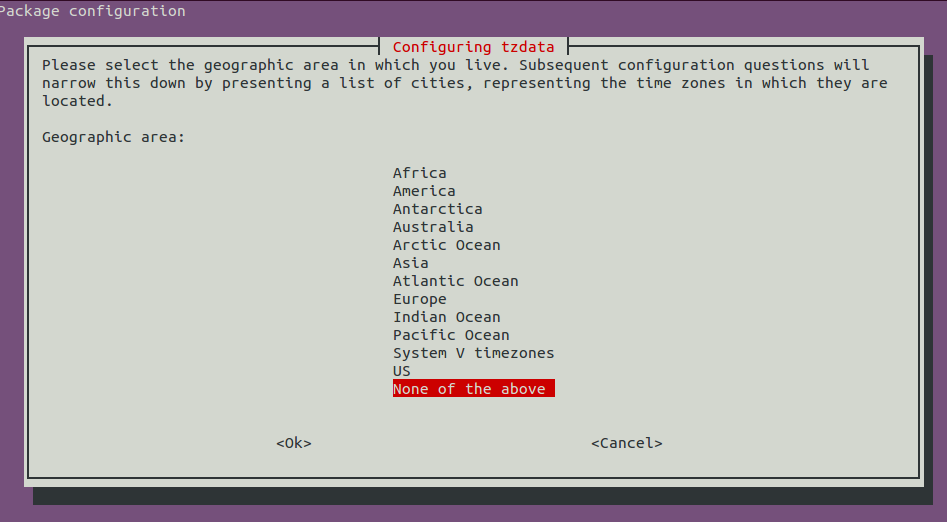

I keep getting an error every time I try to sudo apt update

**Updates for this repository will not be applied.**

I solved this issue by installing ntp

**# apt install ntp**

**# dpkg-reconfigure tzdata**

